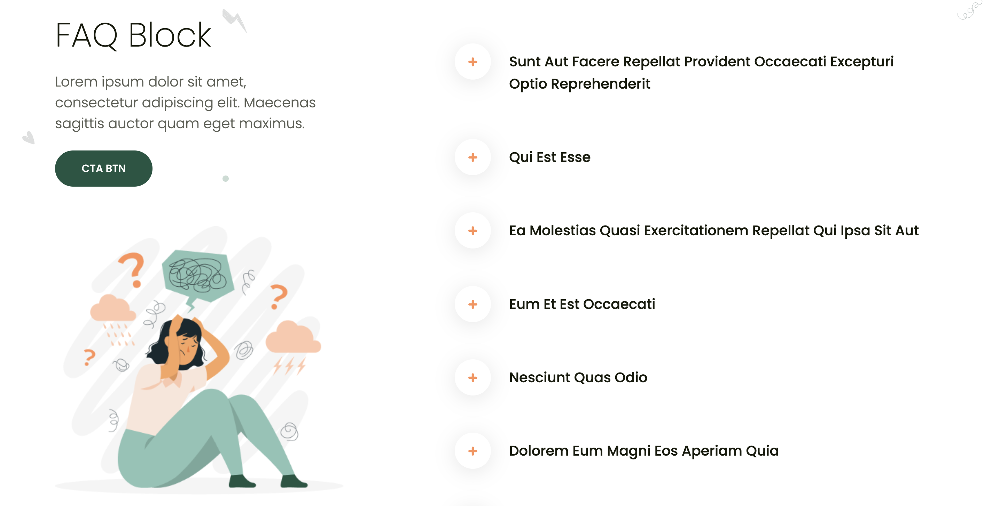

# Mindwell Hub

## Description

Mindwell is a comprehensive WordPress project consisting of a theme and a plugin. The theme is a child theme of twentytwenty, while the plugin enhances your website by providing a custom Gutenberg block for seamlessly integrating an FAQ section.

## 📝 Features

### Mindwell Plugin [mu-plugin]

- **Accordion Inner Block:** Dynamically fetches accordion posts from a specified API URL, providing flexibility in content management.
- **Custom Accordions:** Users can easily add custom accordions in addition to the default ones retrieved from the API, enhancing content personalization.
- **Heading and Paragraph Blocks:** Integrate a dedicated heading block and paragraph block for crafting section titles and descriptions effortlessly.
- **Image and Button Options:** Customize your FAQ section further by adding images and buttons, allowing for a visually appealing and interactive user experience.
- **Typography Customization:** Tailor the design of key elements on the left-hand side, including Heading, Description, and Button Text, to align with your website's aesthetics.
- **Fully Responsive:** Ensures optimal user experience across various viewports, making it suitable for all devices.

## 🎥 Preview of the custom block

### Mindwell Theme

- **Front Page Template:** Provides the front page template to match the homepage design.
- **Header and Footer Template Parts:** Includes header and footer template parts for consistency.
- **Hero and FAQ Section Patterns:** Offers various patterns for the hero and FAQ section to enhance the visual appeal.
- **Responsive and i18n-ready:** Ensures responsiveness and internationalization readiness for a broader audience.
- **Child Theme of TwentyTwenty:** Mindwell theme is a child theme of the TwentyTwenty theme. Please install TwentyTwenty theme in the admin panel before activating the Mindwell theme.

## 👨🏻‍💻 Installation

Replace your existing `wp-content` folder with the one provided in the Mindwell WordPress project repository.
